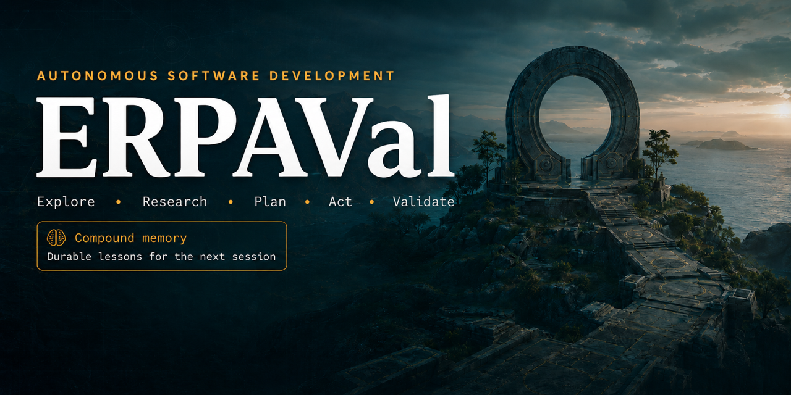
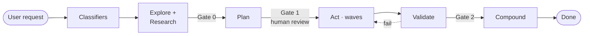
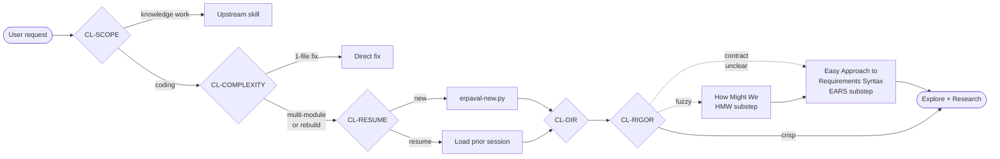
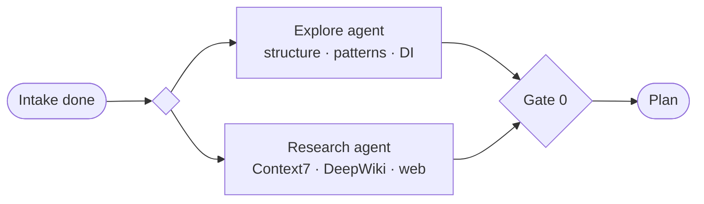
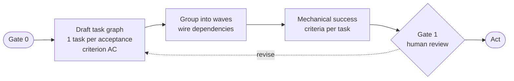
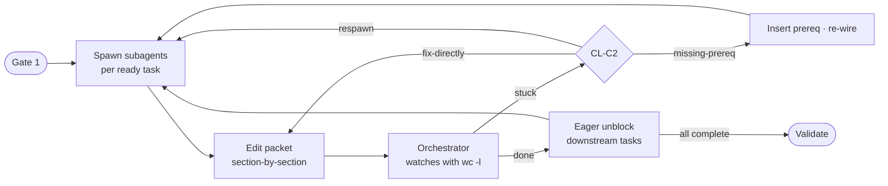
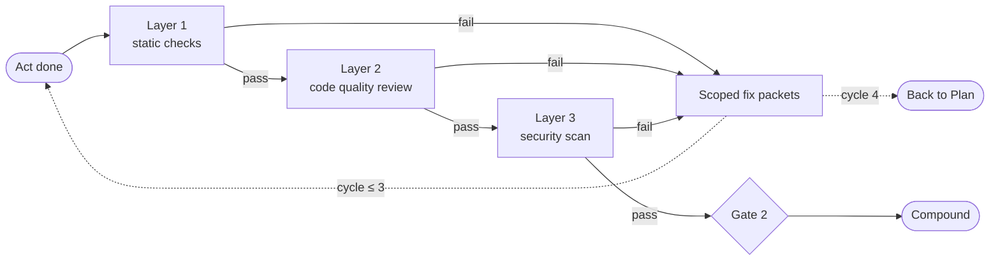
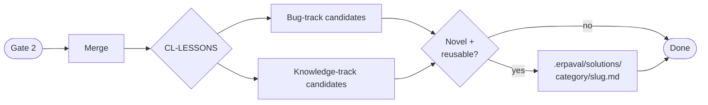

# ERPAVal



**Autonomous software development for Claude Code.**

ERPAVal stands for **Explore · Research · Plan · Act · Val**idate — the five-phase loop, plus a sixth **Compound** phase that writes durable lessons to disk so the next session inherits what this one learned.

Six phases, classifier-driven routing, and a compounding memory layer that makes every session smarter than the last.

> A structured workflow for teams of Claude Code agents that build software the way a senior engineer would — if that engineer could run ten of themselves in parallel and actually remember what they learned yesterday.

> [!NOTE]
> ERPAVal has only been tested with [Claude Code](https://claude.ai/code). It relies on Claude Code's
> `Agent` tool, `TaskCreate`/`TaskUpdate`/`TaskList` task system, plugin hooks (`SessionStart`,
> `PostToolUse`, `Stop`), and `${CLAUDE_PLUGIN_ROOT}` path resolution. It will not work with other
> AI coding tools or generic Claude API integrations.

> [!IMPORTANT]
> **Star → Fork → make it your own.** ERPAVal is opinionated about coding workflow but agnostic
> about everything else. The bundle gives you a working flow on day one, but the workflow is
> designed to absorb your conventions, your team's writing style, your domain's vocabulary. Fork
> this repo, vendor in your own skills, swap out the ones that don't fit, rewrite the classifier
> prompts to match how you think. Re-syncing from upstream `personal-plugins` is intentionally
> manual — users who fork should diverge.

---

## Install

ERPAVal is a Claude Code plugin. There are two ways to install it.

### Option A — Claude Code plugin marketplace (recommended)

Ships everything: skills, agents, hooks, and MCP server config.

In a Claude Code session, run:

```text
/plugin marketplace add theagenticguy/erpaval
/plugin install erpaval@erpaval
```

Adding a marketplace is lazy — nothing loads until you install. The plugin installs to your **user**
scope (available in every project) by default. To scope it to one project instead, use
`/plugin install erpaval@erpaval --scope project`.

Then enable the plugin and reload so its skills, agents, and hooks activate:

```text
/plugin            # → Installed tab → erpaval → Enable
/reload-plugins
```

Verify by listing skills:

```text
/help              # /erpaval:* should appear in the namespace
```

To uninstall:

```text
/plugin uninstall erpaval
/plugin marketplace remove theagenticguy/erpaval
```

> [!NOTE]
> If `/plugin marketplace add` reports "not found", update Claude Code to a recent version
> (`v2.1.x` or later) and retry.

### Option B — `skills.sh` CLI (skills only, multi-agent)

[skills.sh](https://skills.sh) is the open agent-skills directory. Its CLI installs the **skills**
to whichever coding agents you have locally — Claude Code, Cursor, Codex, Windsurf, and ~50 others.
It does **not** install the hooks, agents, or MCP server config that the plugin marketplace ships.

```bash
npx skills add theagenticguy/erpaval
```

Use this path if you want ERPAVal's skills available across multiple agents. Use Option A if you
want the full Claude Code experience (compounding lessons, validation hooks, the Compound-phase
nudge).

### Option C — Local development install

To hack on the plugin without going through either:

```bash
git clone https://github.com/theagenticguy/erpaval
claude --plugin-dir ./erpaval
```

---

## The problem

For single-file changes, the basic loop works: give Claude a task, get working code back, ship it.
The loop breaks when a task touches multiple modules, depends on unfamiliar APIs, or requires
coordinating work across files that reference each other.

It breaks in a second, quieter way: the next session starts from scratch — even though the previous
one just spent two hours learning the codebase's peculiarities.

> [!IMPORTANT]
> The failure mode of unstructured AI coding is not broken code. It is plausible code that does not
> belong, written by an agent that forgot last week's lessons.

ERPAVal fixes both: it **front-loads understanding**, crystallizes intent into a per-task context
packet, hands each implementing subagent a curated briefing, and closes the loop by writing what was
learned to disk so future sessions inherit it.

---

## The flow

The high-level shape is a six-phase pipeline gated by mechanical dependency checks, with one
deliberate human review at Gate 1.



| Phase        | Purpose                                          | Parallelizable with  |
| ------------ | ------------------------------------------------ | -------------------- |
| **Explore**  | Build a mental model of the codebase             | Research             |
| **Research** | Fetch live API docs, version pins, patterns      | Explore              |
| **Plan**     | Decompose into a dependency-wired task graph     | —                    |
| **Act**      | Delegate to parallel subagents per task          | Per dependency graph |
| **Validate** | 3-layer static + quality + security check        | Partially            |
| **Compound** | Extract durable lessons to `.erpaval/solutions/` | —                    |

Gates are mechanical dependency blockers, not approval queues. `addBlockedBy` wires every phase to
its predecessors — the orchestrator reads `TaskList` and advances the moment predecessors flip to
`completed`. The one exception is **Gate 1** (Plan → Act), which is a deliberate human
design-review checkpoint. Catching a wrong abstraction here saves hours of agent rework.

---

## Before the phases: adaptive classifiers

ERPAVal never runs its full machinery on a one-line bug fix. Before Explore starts, a chain of
classifiers — labelled `CL-*` so they're easy to grep in the session trace — decides which phases
apply.



| Classifier        | Decision                                       | Effect                                                                                             |
| ----------------- | ---------------------------------------------- | -------------------------------------------------------------------------------------------------- |
| **CL-SCOPE**      | Coding or knowledge work?                      | Knowledge work routes to an upstream skill (research, Product Requirements Doc (PRD), strategy, …) |
| **CL-COMPLEXITY** | 1-file fix, multi-module, or rip-and-replace?  | 1-file skips ERPAVal entirely                                                                      |
| **CL-RESUME**     | New session or resume a prior one?             | New scaffolds `session-<hex>/`; resume reads prior state and continues                             |
| **CL-DIR**        | Empty dir, existing code, or rebuild-in-place? | Empty skips Explore; rebuild explores both existing and target patterns                            |
| **CL-RIGOR**      | Crisp problem, or needs HMW / EARS framing?    | Fuzzy → HMW substep; contract-unclear → EARS substep; crisp → skip both                            |
| **CL-SPEC**       | PRD, stack, and concept ready?                 | Missing prerequisites loop through `product-discovery` and `build-stack`                           |
| **CL-VALIDATE**   | All 3 validation layers green?                 | Failure routes back to Act with scoped fix packets                                                 |
| **CL-LESSONS**    | Novel, reusable learnings this session?        | Yes → write to `.erpaval/solutions/`; no → skip                                                    |

Every verdict appends to `classifier_trace` in the session YAML — routing decisions are auditable
after the fact. Claude judges; the user never picks from a menu.

---

## Phases in detail

### Session 0 — mandatory intake

Two tool calls run before any phase.

1. **Recall first (always):** `erpaval-recall.py bootstrap` surfaces category counts from
   `.erpaval/solutions/`. Cold repos print "no prior lessons" and proceed. Warm repos start the
   session already aware of what previous sessions learned.

2. **New or resume:** `CL-RESUME` checks for a prior session within 72 hours on the same module.
   New → `erpaval-new.py` creates `.erpaval/sessions/session-<hex>/intake.yaml`. Resume → reads the
   prior `session.yaml` and continues from the last completed gate. Without a session directory on
   disk, the Compound phase at the end silently no-ops — making the scaffold mandatory at intake is
   what keeps the compounding loop closed.

---

### Explore + Research (parallel)



**Explore** answers: what does this codebase look like, and where do my changes land?

A dedicated exploration agent reads project structure, traces module boundaries, and catalogs
patterns — error handling, dependency injection (DI), logging, test style, build toolchain, lint
config. Output is a
structured summary that becomes the *conventions* section every implementing agent receives.

**Research** fixes the staleness problem. A code-researcher agent fetches current documentation via
Context7, DeepWiki, or web search. It checks package versions, pulls API signatures, usage examples,
and migration guides. The result is a dependency inventory with version pins and concrete patterns.

Both run in parallel — different questions, no data dependency on each other.

---

### Plan



The single most consequential artifact in the flow.

Planning decomposes the implementation into atomic tasks, each completable by a single agent in
isolation, grouped into waves with explicit dependency edges. When intake included an EARS spec, the
plan derives one task per acceptance criterion (AC) — the AC's `[P]` parallel-safe flag carries
forward so the orchestrator can launch safe tasks concurrently.

```text
Wave 1 (parallel):
  Task A: Create data models       → blocks C, D
  Task B: Add API route stubs      → blocks D

Wave 2 (parallel):
  Task C: Implement service layer  → blocks E
  Task D: Implement API handlers   → blocks E

Wave 3:
  Task E: Integration tests
```

Each task carries mechanical success criteria — exact tests, type checks, lint rules. Gate 1 is a
human design-review checkpoint. Expect 2–4 revision rounds; the plan is a senior engineer's
architecture review, not a rubber stamp.

---

### Act



Each task becomes a delegation to a subagent with a **context packet** — a complete, zero-context
briefing that is also the agent's running work log.

**10-section context packet:**

| Section              | Source                                                                     |
| -------------------- | -------------------------------------------------------------------------- |
| Objective            | One sentence from the AC                                                   |
| Scope                | Exact files to create/modify, plus files not to touch                      |
| EARS requirement     | AC text pasted verbatim                                                    |
| Architecture context | Patterns, DI, error handling from Explore                                  |
| API contracts        | Exact signatures and types parallel agents must match                      |
| Conventions          | Naming, imports, async discipline from Explore                             |
| Dependencies         | Pinned versions, breaking changes from Research                            |
| Prior lessons        | `.erpaval/solutions/` files scored relevant by recall                      |
| Success criteria     | Static-check baseline + task-specific verifiable checks                    |
| Anti-goals           | No refactoring, no new deps; report missing prereqs instead of improvising |

The agent edits the packet file section-by-section as it works — the file on disk is the work log.
The orchestrator watches packet files with `wc -l`; a task whose line count is identical across two
consecutive check-ins is flagged as stuck.

**Eager unblocking:** after each task completes, the orchestrator scans the dependency graph for any
downstream work whose blockers have all cleared and launches immediately. On a 26-task run this
saves ~30–40% wall-clock time vs. strict wave-by-wave execution.

**Stuck recovery (CL-C2):** 3 in-task fix attempts via `SendMessage`. On attempt 4, `CL-C2`
classifies the situation as: `fix-directly` (1–2 line inline fix), `respawn` (fresh agent, same
packet), or `missing-prereq` (insert a prereq task, re-wire the dependency graph).

---

### Validate



Three layers, in order:

**Layer 1 — Static checks.** The project's existing toolchain: `ruff check` + `ruff format` +
`pytest` for Python; `pnpm lint` + `tsc` + `pnpm test` for TypeScript. Sub-second lint, sub-minute
type checking.

```text
Agent tight loop:            CI loose loop:
  write → lint (0.3s)          write → push → wait (60–300s)
  → fix → lint (0.3s)          → get error → re-read code
  → typecheck (0.8s)           → fix → push → wait again
  → test module (2s)
  → done (~3.4s total)
```

**Layer 2 — Code quality review.** Dedicated Opus agent analyzes the diff for tech-debt creep,
Don't Repeat Yourself (DRY) violations, dead code, convention drift, and API surface issues static
tools miss.

**Layer 3 — Security scanning.** Semgrep Open Worldwide Application Security Project (OWASP) Top
10, language-specific tools (bandit, npm audit), dependency vulnerability checks, and an
Opus-powered review for logic flaws.

Any failure loops back to Act with scoped fix packets on just the failing tasks. Max 3 fix cycles; a
fourth signals a plan structural problem — return to Plan.

---

### Compound



The phase most autonomous-coding workflows forget.

After Gate 2 clears and work merges, `CL-LESSONS` reads the full session trace and identifies
candidates on two tracks:

- **Bug-track** — root causes uncovered during fix cycles (C2, C4 loops)
- **Knowledge-track** — architectural or API patterns surfaced in Explore/Research that a later run
  would not infer on its own

Each candidate is filtered on two criteria: **novel** (no existing entry already covers it) and
**reusable** (likely to apply elsewhere, not a one-off hack).

Surviving lessons write to `.erpaval/solutions/<category>/<slug>.md` with YAML frontmatter carrying
tags and module scope. The next session's recall step greps this directory and pastes the
top-scoring lessons directly into every task's *Prior lessons* section.

> [!TIP]
> A session that ends without Compound wrote code. A session that ends with Compound wrote code and
> made the next session smarter.

---

## The `.erpaval/` directory

```text
.erpaval/
  INDEX.md                    ← committed — category summary, pointer from CLAUDE.md
  solutions/                  ← committed — durable lessons
    build-errors/
    test-failures/
    deploy-errors/
    architecture-patterns/
    best-practices/
    conventions/
    api-patterns/
  brainstorms/                ← committed — HMW framing outputs
    NNN-<slug>-requirements.md
  specs/                      ← committed — EARS specs + derived task graphs
    NNN-<slug>/
      spec.md
      tasks.md
  sessions/                   ← gitignored — ephemeral, orchestrator-coupled
    .nudged                   ← ledger of sessions already nudged by compound_nudge
    session-<hex>/
      intake.yaml
      recall.yaml
      explore.yaml
      research-<domain>.yaml
      tasks/T-AC-X-Y.md
      validation.yaml
      lessons.yaml
      session.yaml
```

One `.gitignore` line: `.erpaval/sessions/`. Durables compound across the team. Session state is
ephemeral — orchestrator-coupled and a secrets surface.

---

## Bundled skills

This plugin ships the core `erpaval` workflow plus 10 vendored companion skills so that ERPAVal's classifier routes resolve in-bundle. Bundled skills are sanitized forks — narrative-writing helpers (long-form prose composition, organization-specific Legal review, publication formatting) are deliberately not bundled. Fork this repo to drop in your team's writing-style skill.

> The bundled `product-discovery` and `agent-ux-patterns` skills both describe their own six-phase
> flows. They are unrelated to ERPAVal's six phases — different problems, different artifacts,
> different cadence.

| Skill                   | Role in ERPAVal                                                                                                                  |
| ----------------------- | -------------------------------------------------------------------------------------------------------------------------------- |
| `erpaval`               | The workflow — six phases, classifiers, hooks, tools                                                                             |
| `product-discovery`     | HMW + EARS substeps (hard file-load dep); discovery memos, Jobs-To-Be-Done (JTBD), INVEST user stories                           |
| `research`              | Multi-agent research; the file-first write protocol erpaval is adapted from                                                      |
| `ultraplan`             | Generator-critic planning; the parallel-explorer pattern erpaval references                                                      |
| `tech-stack-builder`    | `CL-SPEC → /build-stack` route for greenfield stack selection                                                                    |
| `product-strategy`      | `CL-SCOPE → /product-strategy` route (Rumelt, Wardley, Minto, Press Release / FAQ (PR-FAQ) as discovery)                         |
| `working-backwards`     | 5-stage Working Backwards / PR-FAQ / 5 Customer Questions (5CQ)                                                                  |
| `customer-research`     | Hypothesis + null + Mutually Exclusive Collectively Exhaustive (MECE) + findings; Pyramid-base output for downstream composition |
| `meta-prompt-optimizer` | Prompt audit + rewrite; the prompt-quality companion                                                                             |
| `product-design-shared` | Canonical framework references shared by discovery / strategy / working-backwards                                                |
| `agent-ux-patterns`     | Agent UX patterns (Agent-to-Human (A2H) handoff, Levels of Autonomy, inbox, progressive trust) — referenced by discovery         |

### Re-sync a vendored skill from upstream

Manual `cp -R` is the procedure. No sync script — drift is a feature for a fork-friendly plugin.

```bash
SKILL=product-discovery
cp -R /path/to/personal-plugins/skills/$SKILL/ ./skills/$SKILL/
grep -rn "personal-plugins:" skills/$SKILL/   # if non-empty, sed-strip
git diff skills/$SKILL/                       # spot-check
mise run validate                             # confirm I1/I2/I3 invariants hold
git commit -am "chore: resync $SKILL from upstream"
```

---

## Knowledge work in ERPAVal

Plenty of Claude Code work is **knowledge work**, not coding: drafting a PRD, synthesizing customer
interviews, writing a strategy memo, building a slide deck, reviewing a design, modeling a
spreadsheet, storyboarding a customer journey, designing an agent's UX, writing a video script,
authoring a Model Context Protocol (MCP) server, auditing a prompt, running a literature review,
triaging an inbox.

ERPAVal's `CL-SCOPE` classifier triages knowledge work to upstream skills instead of forcing it
through the coding pipeline. The bundle covers the common ones — `/product-discovery`,
`/product-strategy`, `/research`, `/working-backwards`, `/customer-research`,
`/meta-prompt-optimizer`. Other knowledge-work tasks have specialized skills with their own write
protocols, role prompts, and templates.

Many of those skills live in [`personal-plugins`](https://github.com/lalsaado/personal-plugins) — install alongside ERPAVal or fork into your own bundle. ERPAVal won't break if a route resolves to a missing skill — Claude will tell you, and you can either install the companion or do the work directly.

---

## MCP servers and API keys

The plugin's `.mcp.json` declares four research servers used by `agents/researcher.md`. Set the env vars below to enable them — without keys, the servers fail at session start (`deepwiki` works without a key) and the researcher agent falls back to `WebFetch` / `WebSearch` per its **Provider availability and fallbacks** table.

| Server         | Env var            | Source                                   |
| -------------- | ------------------ | ---------------------------------------- |
| `context7`     | `CONTEXT7_API_KEY` | <https://context7.com>                   |
| `brave-search` | `BRAVE_API_KEY`    | <https://api-dashboard.search.brave.com> |
| `exa`          | `EXA_API_KEY`      | <https://dashboard.exa.ai>               |
| `deepwiki`     | (none)             | hosted, no key required                  |

---

## Smoke test

Quick sanity-check that the plugin loads and the classifier flow is intact. Assumes you've already
installed via Option A or Option C above:

```bash
mkdir /tmp/erpaval-smoke && cd /tmp/erpaval-smoke
git init && echo "# Test" > README.md
claude
# in session: "Use erpaval to plan adding a hello world Python script"
```

Pass criteria: `SessionStart` hook is silent on a cold repo (correct), `CL-SCOPE` returns `coding`, `CL-COMPLEXITY` either exits early on `1-file-fix` or scaffolds `.erpaval/sessions/session-<hex>/` via `erpaval-new.py`. `mise run validate` exits 0.

---

## Repo structure

```text
.claude-plugin/plugin.json            plugin manifest
.mcp.json                             MCP servers (context7, deepwiki, brave-search, exa)
hooks/
  framework.py                        Pydantic hook framework (fail-open)
  hooks.json                          event bindings
  session_start_bootstrap.py          SessionStart — emits prior-lesson summary
  validate_packet.py                  PostToolUse(Write|Edit) — schema-checks .erpaval/ writes
  compound_nudge.py                   Stop — one-shot block when Compound is pending
skills/
  erpaval/
    SKILL.md                          main skill entry point
    references/                       flow, classifiers, glossary, orchestrator,
                                      context-packets, write-protocol,
                                      validation-playbook, compound, fan-out,
                                      solution-categories.yaml
    templates/
      session/                        intake, recall, explore, research, session,
                                      validation, lessons YAMLs + worklog-skeleton.md
      solutions/                      lesson-bug.md, lesson-knowledge.md
      specs/                          spec.md, tasks.md
      brainstorms/                    requirements.md
      INDEX.md
    tools/
      erpaval-new.py                  scaffold session dir
      erpaval-recall.py               tag-scored lesson retrieval
      erpaval-validate.py             YAML packet schema check
  product-discovery/                  HMW + EARS + discovery memos (hard file-load dep)
  research/                           multi-agent research + file-first write protocol
  ultraplan/                          generator-critic parallel planning
  tech-stack-builder/                 stack recommendations + Architecture Decision Record (ADR) composition
  product-strategy/                   Rumelt, Wardley, Minto, PR-FAQ as discovery
  working-backwards/                  5-stage WB / PR-FAQ / 5CQ
  customer-research/                  hypothesis + null + MECE + findings
  meta-prompt-optimizer/              prompt audit + rewrite
  product-design-shared/              canonical framework refs (DD, JTBD, WB, Pyramid, research-design)
  agent-ux-patterns/                  A2H, Levels of Autonomy, inbox, progressive trust
agents/
  researcher.md                       Research-phase agent (with provider availability + fallback table)
scripts/
  validate-plugin.sh                  parse configs, load tools/hooks, assert I1/I2/I3 invariants
```

---

## Tools

All tools under `skills/erpaval/tools/` are [PEP 723](https://peps.python.org/pep-0723/)
inline-dependency scripts. Run with `uv run` — no venv needed.

```bash
# Scaffold a new session directory
uv run ${CLAUDE_PLUGIN_ROOT}/skills/erpaval/tools/erpaval-new.py --request "Add PKCE to OAuth flow"

# Session-start recall bootstrap
uv run ${CLAUDE_PLUGIN_ROOT}/skills/erpaval/tools/erpaval-recall.py bootstrap

# Per-task lesson retrieval
uv run ${CLAUDE_PLUGIN_ROOT}/skills/erpaval/tools/erpaval-recall.py search \
  --module src/auth --tags oauth,pkce --limit 5

# Schema-check a YAML packet (also runs automatically via hook)
uv run ${CLAUDE_PLUGIN_ROOT}/skills/erpaval/tools/erpaval-validate.py .erpaval/sessions/session-abc123/intake.yaml
```

---

## Hooks

Three hooks wire ERPAVal into the Claude Code session lifecycle. All are fail-open — an uncaught
exception logs to stderr and exits 0, so a broken hook cannot wedge a session.

| Hook                         | Event                      | Role                                                                                                                                                                                        |
| ---------------------------- | -------------------------- | ------------------------------------------------------------------------------------------------------------------------------------------------------------------------------------------- |
| `session_start_bootstrap.py` | `SessionStart`             | Emits `.erpaval/solutions/` category counts as `additionalContext`. Fires once per session; only when a session dir was modified in the last 24 h.                                          |
| `validate_packet.py`         | `PostToolUse(Write\|Edit)` | Pydantic schema-checks any write under `.erpaval/`. Advisory on failure — never blocks. Also drops a cross-hook marker so `compound_nudge` knows this session touched ERPAVal.              |
| `compound_nudge.py`          | `Stop`                     | One-shot `decision: block` when Compound is pending. Six gates must all hold; fires at most once per session and records the session ID in `.erpaval/sessions/.nudged` so it won't re-fire. |

---

## Optional rigor — HMW + EARS

`CL-RIGOR` decides whether to run these substeps before Explore.

**HMW (fuzzy problems):** reframes a vague or solution-shaped ask into 3–5 outcome-level
"How Might We" questions using 3 of 9 d.school strategies, validated against Nielsen Norman Group
(NN/g) guardrails.

Output seeds `brainstorms/NNN-<slug>-requirements.md`.

**EARS (contract-unclear tasks):** Easy Approach to Requirements Syntax. Writes numbered,
dependency-annotated ACs using the 5 EARS templates (Ubiquitous, Event-driven, State-driven,
Optional feature, Unwanted behavior). Each AC carries `[P]` (parallel-safe) or
`Dependencies: AC-X-Y`. Plan derives one task per AC directly. Output seeds
`specs/NNN-<slug>/spec.md`.

Both substeps are well-suited to subagent delegation — bounded creative tasks with durable file
output.

---

## When to use ERPAVal

`CL-COMPLEXITY` makes this call automatically, but the heuristic is worth stating:

| Scenario                                 | Verdict                                                    |
| ---------------------------------------- | ---------------------------------------------------------- |
| Feature touching multiple modules        | multi-module → full flow                                   |
| Bug fix in a single file                 | 1-file-fix → skip ERPAVal                                  |
| Greenfield project setup                 | multi-module + empty-dir → skip Explore, start at Research |
| Rip-and-replace rebuild                  | rebuild → full flow + destructive Wave 1                   |
| Refactoring with behavioral preservation | multi-module → full flow                                   |
| Integrating a new dependency or API      | multi-module → heavy Research phase                        |
| Quick script or one-off tool             | 1-file-fix → skip ERPAVal                                  |

> [!TIP]
> If a senior engineer would want to review the approach before coding starts, use ERPAVal.
> If not, just code.

---

## Development

Requires [mise](https://mise.jdx.dev/).

```bash
mise install            # install node, markdownlint-cli2, dprint
mise run fmt            # format all markdown and JSON
mise run fmt:check      # check formatting (CI-safe)
mise run lint           # lint all markdown files
mise run lint:md:fix    # auto-fix lint issues
mise run validate       # configs parse + tools/hooks load + cross-ref invariants I1/I2/I3
mise run build          # full pipeline: lint + format check + validate
mise run bump -- patch  # bump version (major|minor|patch)
```

---

## In practice

Over two weeks of daily use across ~12 Claude Code projects: 28 ERPAVal invocations, 22 sessions,
assistant message counts from 89 to 1,458. A single overnight rebuild session fired 138 subagent
spawns, 516 `TaskCreate` calls, 1,249 `TaskUpdate` calls, and 363 `Agent` calls — and wrote 13
durable lessons to `.erpaval/solutions/` at the end. A follow-on session two days later pulled 3 of
those lessons into its Act packets before writing a line of code.

That is the compounding loop closing in practice.

---

## License

MIT
