## Contents

| Reference                                                                     | When to load                                                                                                 |
| ----------------------------------------------------------------------------- | ------------------------------------------------------------------------------------------------------------ |
| `references/flow.md`                                                          | The graph — intake, build loop, validate/compound, cycles                                                    |
| `references/classifiers.md`                                                   | Prompt text for each `CL-*` classifier                                                                       |
| `references/glossary.md`                                                      | `CP-*`, `CL-*`, gates, cycles, zones, placeholder tokens                                                     |
| `${ERPAVAL_HOME}/skills/product-discovery/references/roles/hmw-framer.md`     | HMW substep (hard-dep on `product-discovery`; run when `CL-RIGOR` asks for HMW)                              |
| `${ERPAVAL_HOME}/skills/product-discovery/references/roles/ears-specifier.md` | EARS substep (hard-dep on `product-discovery`; run when `CL-RIGOR` asks for EARS)                            |
| `references/orchestrator.md`                                                  | Per-phase runbook — NL subagent dispatch, filesystem-driven gates, `/todo` mirror, `summary` return contract |
| `references/context-packets.md`                                               | Per-packet YAML schemas + two-gate review + auto-merge rules                                                 |
| `references/write-protocol.md`                                                | Canonical write-protocol block (copied into every Act prompt)                                                |
| `references/validation-playbook.md`                                           | 3-layer validation + closed-loop toolchain                                                                   |
| `references/compound.md`                                                      | Dual-track lesson schema + recall retrieval algorithm                                                        |
| `assets/session/task-skeleton.md`                                             | Per-task packet skeleton with embedded write protocol                                                        |
| `assets/session/`                                                             | YAML schemas the orchestrator seeds into `.erpaval/sessions/<id>/` at runtime                                |
| `assets/specs/`                                                               | EARS spec and task-list skeletons for the Framing substep                                                    |
| `assets/solutions/`                                                           | Lesson templates (bug, knowledge) the Compound phase writes from                                             |
| `assets/brainstorms/`                                                         | HMW requirement skeletons for the Framing substep                                                            |
| `assets/INDEX.md`                                                             | Recall-phase index of lessons by category, read at session start                                             |

# ERPAVal — adaptive autonomous software development

A six-phase workflow with two framing substeps and a compounding tail. The orchestrator (the Kiro CLI session running the `erpaval-orchestrator` agent) runs classifiers to decide which phases apply, delegates implementation to subagents, and persists Markdown + YAML packets under `.erpaval/` so future sessions start smarter than this one.

## The graph at a glance

```mermaid
flowchart LR
  IN[Intake + Recall bootstrap] --> SCOPE{Scope?}
  SCOPE -->|coding| COMPLEX{Complexity?}
  SCOPE -->|non-coding| ROUTE[Upstream skill]
  COMPLEX -->|1-file fix| DIRECT[Direct fix]
  COMPLEX -->|multi-module or rebuild| RESUME{New or resume?}
  RESUME -->|new| NEW[erpaval-new.py]
  RESUME -->|resume| PRIOR[Load prior session]
  NEW --> DIR{Dir state?}
  PRIOR --> DIR
  DIR --> RIGOR{Rigor?}
  RIGOR -.->|fuzzy| HMW[HMW frame]
  RIGOR -.->|contract unclear| EARS[EARS spec]
  HMW --> EARS
  EARS --> ER[Explore + Research]
  RIGOR -->|crisp| ER
  ER --> PLAN[Plan]
  PLAN --> G1{Gate 1}
  G1 -.->|revise| PLAN
  G1 -->|approved| ACT[Act · waves]
  ACT --> VAL[Validate]
  VAL -.->|fail| ACT
  VAL -->|pass| G2{Gate 2}
  G2 --> MERGE[Merge]
  MERGE --> COMP[Compound · extract lessons]
  COMP --> DONE([Done])
```



Full three-view graph with every cycle is in `references/flow.md`. Dashed edges are named cycles.

## Strict phase gating via filesystem state

Each phase has a completion gate enforced by the orchestrator reading the `status:` frontmatter of per-task Markdown packets at `.erpaval/sessions/<id>/tasks/T-AC-X-Y.md`. The orchestrator advances a wave only when every blocker packet has `status: COMPLETE`. Kiro's `/todo` slash command mirrors progress for the user but is **advisory only** — the authoritative state lives in the packet files.

> **Kiro gap shim — task dependencies.** Kiro's `/todo` does not support `addBlockedBy` semantics; only `add` and `complete`. ERPAVal therefore drives gate enforcement from the filesystem (per-task packet `status:` frontmatter) and uses `/todo` for the user-visible progress mirror. The packet files are the source of truth.

Per-task Markdown packets at `.erpaval/sessions/<id>/tasks/T-AC-X-Y.md` double as subagent work logs — the agent edits them section-by-section per `write-protocol.md`, and the orchestrator monitors with `wc -l`. Partial progress on disk survives subagent timeouts; state held in working memory does not.

See `references/orchestrator.md` for the per-phase runbook.

## Session 0 — mandatory intake scaffolding

Two steps the orchestrator always runs before Explore, so Compound can actually fire at the end of the session.

1. **Recall first (always).** `uv run ${ERPAVAL_HOME}/skills/erpaval/scripts/erpaval-recall.py bootstrap` surfaces category counts + `INDEX.md` path. Cold repos print `no prior lessons` and proceed. The `agentSpawn` hook on the `erpaval-orchestrator` agent also emits this via STDOUT, but the tool call is the authoritative record — run it.
2. **Decide new vs resume (after `CL-COMPLEXITY` returns multi-module / rebuild).** `CL-RESUME` reads the request, `ls .erpaval/sessions/session-*/` (sorted by mtime), and the top-5 prior `session.yaml` files, then emits one of:
   - **new session** — run `uv run ${ERPAVAL_HOME}/skills/erpaval/scripts/erpaval-new.py --request "<raw_request>"`. Creates `.erpaval/sessions/session-<hex>/intake.yaml`, ensures `.gitignore` and `INDEX.md`. **Required** — without a `session-<hex>/` dir, the `stop`-hook six-gate check never clears and Compound silently no-ops.
   - **resume session** — read the prior `session.yaml` + latest `tasks/*.md`, append the new ask to `intake.yaml.raw_request`, continue from the last completed gate. Do not scaffold a new `session-<hex>/`.

For 1-file fixes, `CL-COMPLEXITY` exits the flow before Session 0 step 2 — recall-only is correct; no session dir needed.

See `references/classifiers.md` for the `CL-RESUME` prompt and `references/orchestrator.md` for the runbook.

## Pre-phase classifiers — where adaptation lives

Before Explore starts, the orchestrator runs classifiers to decide which phases to run. The orchestrator agent judges — the user never picks from a menu.

| Classifier        | Question                                      | Skips / routes                                                                                                                      |
| ----------------- | --------------------------------------------- | ----------------------------------------------------------------------------------------------------------------------------------- |
| **CL-SCOPE**      | Is this a coding task?                        | Non-coding → route to `/research`, `/product-discovery`, `/product-strategy`, `/working-backwards`, `/customer-research`, etc.      |
| **CL-COMPLEXITY** | 1-file fix · multi-module · rip-and-replace?  | 1-file → skip ERPAVal, just fix                                                                                                     |
| **CL-RESUME**     | New session or resume a prior one?            | new → `erpaval-new.py`; resume → read prior `session-<hex>/` and continue. Runs only when `CL-COMPLEXITY` is multi-module / rebuild |
| **CL-DIR**        | Empty dir · existing code · rebuild-in-place? | Empty → skip Explore, start at Research                                                                                             |
| **CL-RIGOR**      | Problem crisp, or needs HMW / EARS?           | Crisp → skip both; fuzzy → HMW; contract-unclear → EARS; both when needed                                                           |
| **CL-SPEC**       | PRD / stack / concept ready?                  | Missing → loop through `/product-discovery`, `/build-stack` (product-discovery covers PRD drafting and design-thinking methodology) |
| **CL-VALIDATE**   | All 3 validation layers green?                | Fail → C4 back to Act                                                                                                               |
| **CL-C2**         | Attempt-4 escalation in a stuck subagent?     | fix-directly / respawn / missing-prereq (C3)                                                                                        |
| **CL-LESSONS**    | Session produced novel learnings?             | Yes → write to `.erpaval/solutions/`; no → skip                                                                                     |

See `references/classifiers.md` for each classifier's prompt text.

## Optional rigor — HMW + EARS

`CL-RIGOR` decides whether to run these substeps. Both are well-suited to subagent delegation (bounded creative task, durable file output). erpaval hard-deps on `product-discovery` for these substeps: the orchestrator seeds `brainstorms/NNN-<slug>-requirements.md` or `specs/NNN-<slug>/spec.md` from `${ERPAVAL_HOME}/skills/product-discovery/assets/hmw-skeleton.md` / `ears-spec-skeleton.md` and dispatches one general-purpose subagent per substep that reads `${ERPAVAL_HOME}/skills/product-discovery/references/roles/hmw-framer.md` (or `ears-specifier.md`) as its role prompt. Dispatch via in-chat NL: `> Use a general-purpose agent to frame this as HMW per the role prompt at …; final step: call the built-in`summary`tool with the framing.`

- **HMW** (fuzzy problems) — customer-problem template, 3 of 9 d.school strategies, NN/g-validated HMW statements.
- **EARS** (unclear contracts) — 5 templates (Ubiquitous, Event-driven, State-driven, Optional feature, Unwanted behavior). Each AC carries `[P]` (parallel-safe) or `Dependencies: AC-X-Y`. Plan derives tasks directly.

Skip both when the ask names a specific user segment, an observable outcome with a metric, and no solution verbs — see `${ERPAVAL_HOME}/skills/product-discovery/references/frameworks/how-might-we.md` (HMW skip test) and `${ERPAVAL_HOME}/skills/product-discovery/references/frameworks/ears.md` (EARS skip test).

## Phase summary

| Phase        | Purpose                                 | Execution method                                                                      | Parallelizable with  |
| ------------ | --------------------------------------- | ------------------------------------------------------------------------------------- | -------------------- |
| **Explore**  | Build mental model of the codebase      | Parallel NL subagent dispatches (`erpaval-explorer` — split by module, single turn)   | Research             |
| **Research** | Fetch live API docs, versions, patterns | Parallel NL subagent dispatches (`erpaval-researcher` — split by domain, single turn) | Explore              |
| **Plan**     | Derive tasks from EARS spec + deps      | Orchestrator + filesystem packet seeding (with `/todo` mirror)                        | None (needs E+R)     |
| **Act**      | Implement via parallel subagents        | One turn per wave, NL dispatch per task (Kiro caps at 4 concurrent)                   | Per dependency graph |
| **Validate** | Verify correctness, quality, security   | NL subagent dispatch (Opus) + static tools                                            | Partially            |
| **Compound** | Extract lessons from session            | Orchestrator + `compound.md` procedure                                                | None (post-merge)    |

> Research agents start with `date +"%Y-%m-%d"` (always) and `context7` (for library/API/SDK lookups).
> Default recency window is the last 6 months — agentic-AI libraries change monthly.

> **Kiro gap shim — concurrency.** Kiro caps subagent fan-out at **4 parallel**. If a wave declares more than 4 parallel-safe tasks, the orchestrator dispatches them in batches of 4 and waits between batches. Sequential dependencies still form a DAG by reading task-packet `status:` frontmatter.

## When to use ERPAVal

`CL-COMPLEXITY` decides before committing to the full flow.

| Scenario                                 | Classifier verdict                      |
| ---------------------------------------- | --------------------------------------- |
| Feature touching multiple modules        | multi-module → full flow                |
| Bug fix in a single file                 | 1-file-fix → skip ERPAVal               |
| Greenfield project setup                 | multi-module + CL-DIR=empty → skip E    |
| Rip-and-replace rebuild                  | rebuild → full E+R + destructive Wave 1 |
| Refactoring with behavioral preservation | multi-module → full flow                |
| Integrating a new dependency or API      | multi-module → heavy Research phase     |
| Quick script or one-off tool             | 1-file-fix → skip ERPAVal               |

## `.erpaval/` directory — two-zone layout

Placeholder tokens (`NNN`, `<hex>`, `<slug>`, `<domain>`, `T-AC-X-Y`) are defined in `references/glossary.md`.

```text
.erpaval/
  INDEX.md                       committed — pointer from AGENTS.md
  solutions/                     committed — dual-track lessons
    <category>/                  one folder per entry in
                                 references/solution-categories.yaml
  brainstorms/                   committed — HMW outputs
    NNN-<slug>-requirements.md
  specs/                         committed — EARS specs + derived tasks.md
    NNN-<slug>/
      spec.md
      tasks.md
  sessions/                      gitignored — orchestrator-coupled, ephemeral
    .nudged                      persistent ledger of session-ids already
                                 nudged by kiro_compound_nudge.py (one line per id)
    session-<hex>/
      intake.yaml
      recall.yaml
      explore.yaml
      research-<domain>.yaml
      tasks/T-AC-X-Y.md
      validation.yaml
      lessons.yaml
      session.yaml
```

Single `.gitignore` line: `.erpaval/sessions/`. The durables compound across team. Session state is orchestrator-coupled (subagent names, tool IDs, task schema) and a secrets surface — archive to object storage if audit is needed.

## Recall + Compound — the compounding loop

Every session starts by reading prior lessons and ends by writing new ones:

- **Session start** — the `agentSpawn` hook on the `erpaval-orchestrator` agent (`kiro/hooks/kiro_session_start_bootstrap.py`) emits category counts from `.erpaval/solutions/` to STDOUT, which Kiro folds into the conversation context. Fires once per session; no-ops for projects without `.erpaval/`.
- **Pre-Act** — the orchestrator queries `erpaval-recall.py` per task during Plan → Act, populating each packet's Prior Lessons section via tag / module scoring.
- **Mid-session** — the orchestrator agent invokes recall ad-hoc when a new sub-problem emerges that prior sessions may have hit.
- **Post-merge** — Compound runs as the sixth phase. CL-LESSONS filters candidates by novelty + reusability. Writes to `solutions/<category>/<slug>.md`, updates `INDEX.md`, adds the AGENTS.md pointer if missing, records `sessions/<id>/lessons.yaml`. The `stop` hook (`kiro/hooks/kiro_compound_nudge.py`) emits a one-shot **advisory STDERR warning** when all six gates hold (see Tools and hooks table); once fired, the session-id is written to `.erpaval/sessions/.nudged` and won't re-fire.

> **Kiro gap shim — Stop semantics.** Unlike Claude Code, Kiro `stop` hooks **cannot block-and-re-prompt**. Exit code 2 is not honored on `stop`; only STDERR-as-warning is supported. The Compound nudge is therefore advisory: when the user sees the warning, they (or the orchestrator agent on the next turn) should explicitly run `/erpaval` (or invoke the skill via NL) to drive the Compound phase. The `.erpaval/sessions/.nudged` ledger ensures the warning fires exactly once per session.

Compound can also run ad-hoc when the user wants to force-extract lessons mid-session. See `references/compound.md` for the dual-track schema, scoring formula, and operating sequence.

## Ecosystem integration

### Upstream skills (run before ERPAVal)

| Skill                                        | When to use first                                                                      |
| -------------------------------------------- | -------------------------------------------------------------------------------------- |
| **Product Discovery** (`/product-discovery`) | Define what to build before planning how (PRD drafting, HMW, EARS, user stories, JTBD) |
| **Tech Stack Builder** (`/build-stack`)      | Select technologies for greenfield projects                                            |
| **Product Strategy** (`/product-strategy`)   | Business strategy frameworks (Rumelt, Wardley, Minto, Working Backwards)               |

`CL-SPEC` loops through these automatically if any are missing.

### Phase-level agent mapping

| Phase    | Agent used                                                                                                    |
| -------- | ------------------------------------------------------------------------------------------------------------- |
| Explore  | Bundled `erpaval-explorer` agent at `kiro/agents/erpaval-explorer.json`                                       |
| Research | Bundled `erpaval-researcher` agent at `kiro/agents/erpaval-researcher.json`                                   |
| Act      | General-purpose subagents via NL dispatch (model is set in the subagent's agent JSON, not at invocation time) |
| Validate | Opus subagents for code quality and security review                                                           |
| Compound | Orchestrator + `compound.md` procedure (invokes opus for CL-LESSONS)                                          |

## Tools and hooks

Hooks are configured **inline** in the `hooks` field of `kiro/agents/erpaval-orchestrator.json` — Kiro has no plugin-global `hooks.json`. All three hooks are UV-shebang Python scripts built on a Kiro-shaped fork of `framework.py`. Every hook is fail-open via `framework.run_hook` — any uncaught exception logs to stderr and exits 0, so a broken hook cannot wedge a session.

| Hook                              | Kiro event                         | Role                                                                                                                                                                                                                                                                                                                 |
| --------------------------------- | ---------------------------------- | -------------------------------------------------------------------------------------------------------------------------------------------------------------------------------------------------------------------------------------------------------------------------------------------------------------------- |
| `kiro_session_start_bootstrap.py` | `agentSpawn`                       | Emit `.erpaval/solutions/` category counts to STDOUT (Kiro folds STDOUT into conversation context). Fires once per session and only when a `sessions/session-<hex>/` dir was modified in the last 24h — cold repos stay silent.                                                                                      |
| `kiro_validate_packet.py`         | `postToolUse` (matcher=`fs_write`) | Pydantic schema-check writes under `.erpaval/`. Early-exits on non-erpaval paths. Also drops `/tmp/kiro-erpaval-active-<session_id>` as a cross-hook "this Kiro session touched ERPAVal" marker.                                                                                                                     |
| `kiro_compound_nudge.py`          | `stop`                             | One-shot **advisory** STDERR warning when Compound is pending. Six gates: erpaval-active marker, `session-<hex>` name, fresh `validation.yaml` (<2h), no `lessons.yaml`, not nudged this session (HookState), not in `.erpaval/sessions/.nudged` ledger. The warning is informational — Kiro cannot block on `stop`. |

Imperative tools under `scripts/` — PEP 723 scripts invoked via `uv run` by the orchestrator:

| Tool                  | Purpose                                                          | Invoked by                    |
| --------------------- | ---------------------------------------------------------------- | ----------------------------- |
| `erpaval-new.py`      | Scaffold `.erpaval/sessions/session-<hex>/` + seed `intake.yaml` | Orchestrator at session start |
| `erpaval-recall.py`   | Tag-scored grep over `.erpaval/solutions/**.md`                  | Orchestrator per Act task     |
| `erpaval-validate.py` | Pydantic schema check on YAML packet writes (CLI version)        | Manual / CI — hook is primary |

## Kiro CLI compatibility

This skill is the Kiro distribution of erpaval. The Claude Code distribution lives at the repo root (`skills/erpaval/`); this distribution lives at `kiro/skills/erpaval/`. The methodology (six phases, classifiers, gates, cycles, write protocol, EARS, HMW) is identical across both. The differences below are runtime-shape only.

| Concern              | Claude Code distribution                                                        | Kiro distribution                                                                                                                                                                                                                                                                                                          |
| -------------------- | ------------------------------------------------------------------------------- | -------------------------------------------------------------------------------------------------------------------------------------------------------------------------------------------------------------------------------------------------------------------------------------------------------------------------- |
| Plugin root env var  | `${CLAUDE_PLUGIN_ROOT}` (Claude Code injects)                                   | `${ERPAVAL_HOME}` (set by `kiro/install.sh`; defaults to `~/.kiro/erpaval`)                                                                                                                                                                                                                                                |
| Skill subfolders     | `skills/erpaval/{references,templates,tools}/`                                  | `kiro/skills/erpaval/{references,assets,scripts}/` (Agent Skills spec naming)                                                                                                                                                                                                                                              |
| Subagent invocation  | `Task(subagent_type=…, prompt=…, run_in_background=true, isolation="worktree")` | In-chat NL: `> Use the erpaval-explorer agent to …`. Fires Kiro's `subagent` built-in. Returns via the auto-attached `summary` tool — every dispatch prompt must end with `Final step: call the built-in`summary`tool …`. `/spawn` is **not** the orchestrator's primitive; it's a user-driven command for fresh sessions. |
| Concurrency cap      | No documented cap                                                               | **Max 4 parallel** subagents (Kiro hard limit) — large waves dispatch in batches of 4                                                                                                                                                                                                                                      |
| Task primitive       | `TaskCreate` / `TaskUpdate` / `TaskList` / `addBlockedBy`                       | Filesystem-driven (`tasks/T-AC-X-Y.md` `status:` frontmatter) authoritative; Kiro `/todo` mirrors UI                                                                                                                                                                                                                       |
| Hook config location | `hooks/hooks.json` at plugin root (plugin-global)                               | Inline `hooks` field in `kiro/agents/erpaval-orchestrator.json` (per-agent)                                                                                                                                                                                                                                                |
| Hook event names     | `SessionStart`, `PostToolUse(Write\|Edit\|MultiEdit)`, `Stop`                   | `agentSpawn`, `postToolUse(matcher=fs_write)`, `stop`                                                                                                                                                                                                                                                                      |
| Stop hook semantics  | Can re-prompt the model via `decision: "block"` + reason                        | **Advisory only** — STDERR warning, non-blocking. User runs `/erpaval` to invoke Compound when warned.                                                                                                                                                                                                                     |
| Worktree isolation   | `isolation: "worktree"` per Agent call                                          | **No Kiro primitive.** Subagents run in the same working tree; rely on `Scope` discipline in packets.                                                                                                                                                                                                                      |
| Plugin namespacing   | `plugin:skill` syntax                                                           | Flat — skills live as sibling dirs under `~/.kiro/skills/` or `<project>/.kiro/skills/`                                                                                                                                                                                                                                    |

The PEP 723 scripts (`erpaval-new.py`, `erpaval-recall.py`, `erpaval-validate.py`) are runtime-agnostic — identical bytes in both distributions. The methodology references (`flow.md`, `classifiers.md`, `compound.md`, `validation-playbook.md`, `write-protocol.md`, `context-packets.md`) are also runtime-agnostic with light env-var/path rewrites only.
