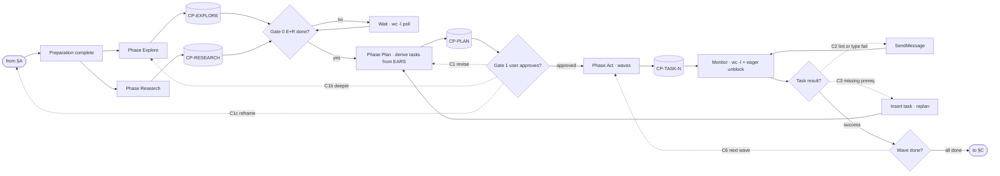
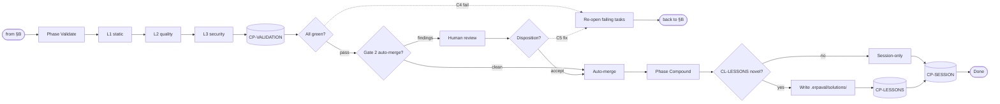

# The adaptive flow

Canonical graph for ERPAVal. Where this file disagrees with the
glance-graph in `SKILL.md`, this file wins. Terms like `CP-*`, `CL-*`,
Gates 0/1/2, and Wave are defined in `glossary.md`.

## Conventions

Solid edges are forward flow. Dashed edges are named cycles. Diamond nodes
are classifiers or gates. Cylinder nodes are persisted context packets
(`CP-*`). Optional steps carry the edge label `fuzzy` or `contract
unclear`. Claude runs them only when `CL-RIGOR` returns the matching
signal. See `classifiers.md` for the prompt text.

## §A — Intake and triage

Session start through "ready to build". Every branch either routes to
another skill, exits, or hands off to §B.

```mermaid
flowchart LR
  START([User request]) --> INTAKE[Intake]
  INTAKE --> CP_INTAKE[(CP-INTAKE)]
  CP_INTAKE --> RECALL[Recall prior lessons]
  RECALL --> CP_RECALL[(CP-RECALL)]
  CP_RECALL --> CL_SCOPE{CL-SCOPE coding?}

  CL_SCOPE -->|non-coding| ROUTE_OTHER[Upstream skill]
  ROUTE_OTHER --> CL_REFINE{CL-REFINE build ask?}
  CL_REFINE -->|yes| CL_SCOPE
  CL_REFINE -->|no| EXIT_NONCODE([Exit · non-coding])

  CL_SCOPE -->|coding| CL_COMPLEXITY{CL-COMPLEXITY}
  CL_COMPLEXITY -->|1-file| DIRECT[Direct fix]
  DIRECT --> COMPOUND_LITE[Compound-lite]
  COMPOUND_LITE --> EXIT_DIRECT([Exit · patched])

  CL_COMPLEXITY -->|multi-module or rebuild| CL_RESUME{CL-RESUME}
  CL_RESUME -->|new| NEW_SESSION[erpaval-new.py · scaffold session-hex]
  CL_RESUME -->|resume| LOAD_PRIOR[Read prior session-hex · append to raw_request]
  NEW_SESSION --> CL_DIR{CL-DIR}
  LOAD_PRIOR --> CL_DIR
  CL_DIR -->|empty| GREENFIELD[Greenfield]
  CL_DIR -->|existing| BROWNFIELD[Brownfield]
  CL_DIR -->|rebuild-in-place| RIPREPLACE[Rip-and-replace]

  GREENFIELD --> CL_RIGOR{CL-RIGOR}
  BROWNFIELD --> CL_RIGOR
  RIPREPLACE --> CL_RIGOR

  CL_RIGOR -.->|fuzzy| FRAME_HMW[Frame HMW]
  FRAME_HMW --> CP_HMW[(CP-HMW)]
  CP_HMW --> FRAME_EARS
  CL_RIGOR -.->|contract unclear| FRAME_EARS[Frame EARS]
  FRAME_EARS --> CP_EARS[(CP-EARS)]
  CL_RIGOR -->|crisp| CL_SPEC{CL-SPEC ready?}
  CP_EARS --> CL_SPEC

  CL_SPEC -->|no PRD| UP_PRD[/product-discovery]
  UP_PRD --> CL_SPEC
  CL_SPEC -->|no stack| UP_STACK[/build-stack]
  UP_STACK --> CL_SPEC
  CL_SPEC -->|fuzzy| UP_DESIGN[/product-discovery]
  UP_DESIGN --> CL_SPEC
  CL_SPEC -->|ready| HANDOFF_B([to §B])
```

## §B — Build loop

Explore through Act, with four cycles. C1, C1b, and C1c handle plan,
re-explore, and reframe. C2 is the in-task fix loop. C3 is the
missing-prereq replan. C6 is wave progression.



## §C — Validate, merge, compound

Three validation layers run in sequence. Gate 2 auto-merges if clean.
Otherwise human dispositions findings. After merge, Compound extracts
lessons from the session trace. This is what makes session N+1 smarter
than session N.



## Named cycles

Cycles are the adaptive core. They let the flow recover from premature
planning, missing context, or bad implementations without restarting. Each
has a bounded re-entry point and a persistence contract.

| ID    | Name                  | Trigger                                              | Re-entry point                                                                        |
| ----- | --------------------- | ---------------------------------------------------- | ------------------------------------------------------------------------------------- |
| `C1`  | Plan revision         | Gate 1 rejection. User amends scope or architecture. | Plan. Each revision diffs `CP-PLAN`. History kept. Expect 2-4 iterations.             |
| `C1b` | Deeper context        | Gate 1 reveals Explore missed a critical area.       | Explore with a scoped prompt. Only the gap is re-explored.                            |
| `C1c` | Reframe problem       | Gate 1 reveals the problem itself was wrong.         | HMW framing. Rare but valuable. EARS spec gets regenerated.                           |
| `C2`  | In-task fix           | Lint, type, or unit-test fail inside a subagent.     | Same subagent via `SendMessage`. Cap 3 attempts. Orchestrator escalates on attempt 4. |
| `C3`  | Missing prereq replan | Subagent reports a missing dependency.               | Plan. Insert missing task, re-wire `addBlockedBy`, resume Act where safe.             |
| `C4`  | Validation fail       | Any of 3 validation layers returns red.              | Act. Re-open failing tasks with scoped fix packets. Validate re-runs.                 |
| `C5`  | Human fix disposition | Gate 2 finding accepted by reviewer as "must fix".   | Act. Same as C4 with human-authored fix instructions.                                 |
| `C6`  | Wave progression      | Current Act wave complete, more waves in plan.       | Act. Self-loop with eager unblocking. Launch next-wave tasks as their blockers clear. |

## Cycle protocols

C1, C1b, and C1c all fire on Gate 1 rejection. Pick by the shape of the
user's feedback. If scope or architecture is wrong, that is C1 (plan
revision). If a specific part of the codebase was not explored, that is
C1b (deeper context). If the problem statement itself was off, that is C1c
(reframe HMW).

C2 protocol. Resume the same subagent with a scoped fix message. Cap at
three attempts. On attempt 4 the orchestrator runs `CL-C2` against the
packet, the agent's last output, and the error. See `classifiers.md` for
the prompt. CL-C2 returns one of three values: `fix-directly` means the
orchestrator applies a 1-2 line fix inline; `respawn` means a fresh agent
on the same packet; `missing-prereq` routes to C3.

C3 protocol. Read the subagent's report, which includes its `summary`
return and the packet's Work log. Seed a new prereq packet
`tasks/T-AC-prereq-X.md` with `status: IN_PROGRESS` and `blocked_by: []`.
Edit the original task's packet frontmatter to add `blocked_by:
[T-AC-prereq-X]` and flip its status back to `BLOCKED`. Mirror with `/todo
add` for visibility. Then dispatch the prereq subagent via NL (`> Use a
general-purpose agent to act as the T-AC-prereq-X subagent ...`). When
the prereq packet flips to `status: COMPLETE`, flip the original task
back to `IN_PROGRESS` and re-dispatch it via NL with updated context.

Missing prereqs often indicate the EARS spec was incomplete. Consider
revising `spec.md` so future sessions do not repeat the gap.

C4 and C5 protocol. Re-open only the failing tasks. Layer 1 re-runs on
touched files only and is fast. Layers 2 and 3 re-run on the full diff.

C6 protocol. After every task completion, scan the dependency graph for
tasks whose blockers are now clear. Launch them immediately, even if
originally scheduled for a later wave. On a 26-task session this saves
roughly 30 to 40 percent wall-clock time versus strict wave-by-wave
execution.

Example. Wave 2 contains tasks A, B, and C. Wave 3 contains tasks D and E,
where D depends only on A. When A completes, launch D. Do not wait for B
and C.
