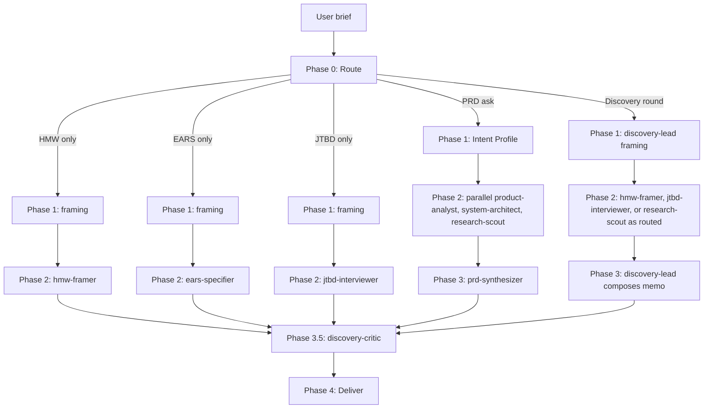

> Slash-command argument convention. Kiro auto-exposes every skill as a
> slash command. When invoked as `/product-discovery <source>`, the body's
> `$ARGUMENTS` substitution resolves to the source path or topic. Typical
> sources are a path to raw content like a brief, notes, or tickets, or a
> one-line topic. The argument is optional. With no arguments the
> orchestrator prompts the user.

## Contents

| Reference | When to load |
| --- | --- |
| `references/orchestrator.md` | Running the pipeline. Five routes, parallel Phase 2, critic review, deliver. |
| `references/write-protocol.md` | Canonical write-protocol block. Copied into every subagent prompt. |
| `references/frameworks/INDEX.md` | Routing guide. Discovery and spec decision tables. Composition rules. |
| `references/frameworks/*.md` | Per-framework files. One per framework. |
| `references/methodology/discovery-rounds.md` | Six-phase discovery methodology. |
| `references/inference-heuristics.md` | Signal-to-inference tables for the PRD-route Intent Profile. |
| `references/quality/prd.md` | Per-section PRD quality bar. Cross-section consistency checks. |
| `references/roles/product-analyst.md` | PRD route. Vision, personas, user stories, IA, milestones. |
| `references/roles/system-architect.md` | PRD route. NFRs, data models, API contracts, edge cases. |
| `references/roles/research-scout.md` | PRD route. Market context and open questions. |
| `references/roles/discovery-lead.md` | Discovery-round route. Problem framing and Double Diamond cadence. |
| `references/roles/hmw-framer.md` | HMW-only route. Also the hard-dep entry point for erpaval CL-RIGOR fuzzy. |
| `references/roles/jtbd-interviewer.md` | JTBD-only route. Job stories from PM-provided source material. |
| `references/roles/ears-specifier.md` | EARS-only route. Also the hard-dep entry point for erpaval CL-RIGOR contract-unclear. |
| `references/roles/prd-synthesizer.md` | PRD route Phase 3. Composes the final PRD from three parallel work logs. |
| `references/roles/discovery-critic.md` | Phase 3.5 critic. Rubric-graded review of any synthesized artifact. |
| `assets/prd-template.md` | 15-section PRD skeleton with `[FILL]` markers. |
| `assets/worklog-skeleton.md` | Per-role work-log skeleton with embedded write-protocol. |
| `assets/discovery-memo.md` | Discovery-round output shape. |
| `assets/double-diamond-workbook.md` | Double Diamond four-stage workbook. |
| `assets/hmw-skeleton.md` | HMW brainstorms file. Lives at `brainstorms/NNN-<slug>-requirements.md`. |
| `assets/jtbd-skeleton.md` | JTBD job-stories file. |
| `assets/ears-spec-skeleton.md` | EARS spec file. Lives at `specs/NNN-<slug>/spec.md`. |

# Product discovery

One skill, five routes. Takes a problem at any maturity and routes to the
right framework pipeline. The maturity range goes from a one-sentence idea
through research notes and fuzzy framing to a clear feature. File-first
write protocol throughout. Every role is a Markdown prompt copied verbatim
into a general-purpose Kiro NL subagent dispatch (`> Use a general-purpose
agent to ...`). Zero custom agent files needed.

## Pipeline at a glance

Full route-by-route runbook, role prompts, check-in cadence, and
stuck-detection recovery live in `references/orchestrator.md`.

## When to run which route

| User signal | Route | Primary output |
| --- | --- | --- |
| "write a PRD", "draft requirements", one-sentence idea | PRD | `{product-slug}-prd.md`, 15 sections |
| "brainstorm a product", "run discovery", "think through this" | Discovery round | `discovery-memo.md` |
| "turn these notes into HMW", "reframe this" | HMW-only | `brainstorms/NNN-{{ slug }}-requirements.md` |
| "spec this for Kiro or Spec Kit", "write EARS ACs" | EARS-only | `specs/NNN-{{ slug }}/spec.md` |
| "write job stories for [segment] from these tickets" | JTBD-only | `jtbd-job-stories.md` |

Default-in-doubt: PRD route. It absorbs the most source-material shapes,
and the three-role parallel research pattern is the skill's strongest lane.

When the brief is genuinely ambiguous, ask the user up to four clarifying
questions in a single message. Then proceed. Do not loop.

## Write-protocol discipline

Every role follows the same rhythm. Edit the output file, then read, then
edit again. Partial work on disk survives subagent termination. Plans held
in working memory do not. The canonical block lives in
`references/write-protocol.md` and is copied verbatim into every role
prompt and every task skeleton.

One file is the source of truth per run. The candidates are
`{product-slug}-prd.md`, `discovery-memo.md`, `brainstorms/NNN-*.md`,
`specs/NNN-*/spec.md`, and `jtbd-job-stories.md`. Nothing else carries the
run.

## Framework family

The skill ships one routing guide and per-framework files. The orchestrator
reads `references/frameworks/INDEX.md` first. That index covers both
discovery frameworks and spec frameworks in one decision table because they
compose as a single pipeline. Discovery frameworks operate upstream in
problem space. Spec frameworks operate downstream and shape contracts. Each
framework's canonical structure, templates, and validation checks live in
its own file in the same `frameworks/` directory.

Discovery frameworks:

- `${ERPAVAL_HOME}/skills/product-design-shared/references/double-diamond.md`
- `frameworks/how-might-we.md`
- `frameworks/jtbd-job-stories.md`

Spec frameworks:

- `frameworks/user-stories-invest.md`
- `frameworks/ears.md`
- `frameworks/gherkin.md`

Common heuristic across both: discovery (HMW or JTBD) leads to PRD (user
stories) leads to spec (EARS for invariants, Gherkin for scenarios). Routes
compose. One run can fire multiple frameworks via the orchestrator's Phase
2 fan-out.

## Discovery methodology

The six-phase methodology lives at
`references/methodology/discovery-rounds.md`. The phases run in this order:
problem framing, scoped research with three vectors, multi-direction
brainstorm, vocabulary mapping, data-model synthesis, and delivery. The
discovery-round route fans out against these phases. The `discovery-lead`
role owns the cadence.

## Ecosystem integration

erpaval hard-deps on two role files as a public API:

- `references/roles/hmw-framer.md`. erpaval's CL-RIGOR `fuzzy` classifier
  spawns this role directly.
- `references/roles/ears-specifier.md`. erpaval's CL-RIGOR
  `contract-unclear` classifier spawns this role directly.

Renames or scope changes to either role are breaking for erpaval. The
orchestrator's ecosystem section in `references/orchestrator.md` documents
the contract. Coordinate breaking changes in the same commit.

## When NOT to use this skill

- Business and product strategy work like Rumelt kernel, Wardley map, or
  PR-FAQ as a leadership artifact. Use `product-strategy` instead.
- Long-form narrative composition. Strategy and discovery here produce the
  thinking. Hand the artifacts to whatever narrative-writing workflow your
  team uses.
- Implementation-only tasks. Use `erpaval` for autonomous coding. This
  skill defines the spec, not the build.

## Anti-patterns

Don't skip framing. A Phase 2 fan-out without a frozen framing.md or Intent
Profile produces divergent agent outputs the synthesizer cannot reconcile.

Don't run more than two critic-revise rounds. After two, surface findings
inline. Critic loops are a stop-energy pattern, not a quality gate.

Don't fabricate job stories or HMWs to meet a count. Three real job stories
beat five fake ones. The jtbd-interviewer and hmw-framer roles will flag
gaps rather than invent.

Don't rewrite across roles. Each role owns a slice. If a sibling role's
output is wrong, flag it in the synthesizer's log. Do not silently rewrite.

Don't bypass the write-protocol. Batched-writes-at-the-end lose work on
timeout. The discipline every role follows is edit, then read, then edit.

Don't confuse upstream and downstream. Job stories are upstream. User
stories are downstream. HMW is upstream. EARS and Gherkin are downstream.
Using the wrong one for the current phase produces artifacts that feel
right but do not land.

Don't delete or rename hmw-framer.md or ears-specifier.md without updating
erpaval. Those are public API. Alias-then-delete for any rename. Coordinate
breaking changes.
