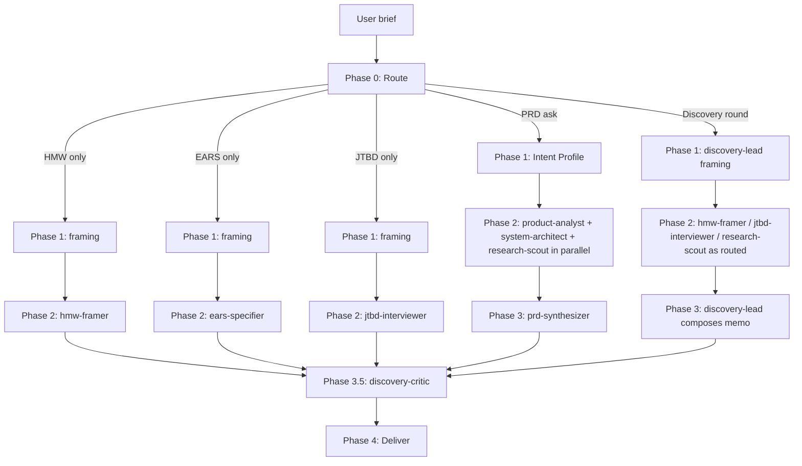

## Contents

| Reference                                    | When to load                                                                                             |
| -------------------------------------------- | -------------------------------------------------------------------------------------------------------- |
| `references/orchestrator.md`                 | Running the pipeline — 5 routes, parallel Phase 2, critic review, deliver                                |
| `references/write-protocol.md`               | Canonical write-protocol block copied into every subagent prompt                                         |
| `references/frameworks/INDEX.md`             | Routing guide — discovery + spec decision tables, discovery → spec composition                           |
| `references/frameworks/*.md`                 | Per-framework files — double-diamond, how-might-we, jtbd-job-stories, user-stories-invest, ears, gherkin |
| `references/methodology/discovery-rounds.md` | Six-phase discovery methodology                                                                          |
| `references/inference-heuristics.md`         | Signal-to-inference tables for PRD-route Intent Profile capture                                          |
| `references/quality/prd.md`                  | Per-section PRD quality bar, cross-section consistency checks                                            |
| `references/roles/product-analyst.md`        | PRD route — vision, personas, user stories, IA, milestones (sections 1-6, 12)                            |
| `references/roles/system-architect.md`       | PRD route — NFRs, data models, API contracts, edge cases (sections 7-10)                                 |
| `references/roles/research-scout.md`         | PRD route — competitive landscape, open questions (sections 11, 13)                                      |
| `references/roles/discovery-lead.md`         | Discovery-round route — pain-point excavation, Double Diamond cadence                                    |
| `references/roles/hmw-framer.md`             | HMW-only route (also hard-dep entry point for erpaval CL-RIGOR fuzzy)                                    |
| `references/roles/jtbd-interviewer.md`       | JTBD-only route — job stories from PM-provided source material                                           |
| `references/roles/ears-specifier.md`         | EARS-only route (also hard-dep entry point for erpaval CL-RIGOR contract-unclear)                        |
| `references/roles/prd-synthesizer.md`        | PRD route Phase 3 — composes final PRD from three parallel work logs                                     |
| `references/roles/discovery-critic.md`       | Phase 3.5 critic — rubric-graded review of any synthesized artifact                                      |
| `templates/prd-template.md`                  | 15-section PRD skeleton with `[FILL]` markers                                                            |
| `templates/worklog-skeleton.md`              | Per-role work-log skeleton with embedded write-protocol                                                  |
| `templates/discovery-memo.md`                | Discovery-round output shape                                                                             |
| `templates/double-diamond-workbook.md`       | Double Diamond four-stage workbook                                                                       |
| `templates/hmw-skeleton.md`                  | HMW brainstorms file — `brainstorms/NNN-<slug>-requirements.md`                                          |
| `templates/jtbd-skeleton.md`                 | JTBD job-stories file                                                                                    |
| `templates/ears-spec-skeleton.md`            | EARS spec file — `specs/NNN-<slug>/spec.md`                                                              |

# Product discovery

One skill, five routes. Takes a problem at any maturity (one-sentence idea, research notes, fuzzy framing, clear feature) and routes to the right framework pipeline. File-first write protocol throughout. Every role is a Markdown prompt copied verbatim into a `general-purpose` `Agent` call — zero custom agent files.

## Pipeline at a glance

Full route-by-route runbook, role prompts, check-in cadence, and stuck-detection recovery live in `references/orchestrator.md`.

## When to run which route

| User signal                                                   | Route           | Primary output                               |
| ------------------------------------------------------------- | --------------- | -------------------------------------------- |
| "write a PRD", "draft requirements", one-sentence idea        | PRD             | `{product-slug}-prd.md` (15 sections)        |
| "brainstorm a product", "run discovery", "think through this" | Discovery round | `discovery-memo.md`                          |
| "turn these notes into HMW", "reframe this"                   | HMW-only        | `brainstorms/NNN-{{ slug }}-requirements.md` |
| "spec this for Kiro / Spec Kit", "write EARS ACs"             | EARS-only       | `specs/NNN-{{ slug }}/spec.md`               |
| "write job stories for [segment] from these tickets"          | JTBD-only       | `jtbd-job-stories.md`                        |

Default-in-doubt: PRD route. Absorbs the most source-material shapes and the 3-role parallel research pattern is the skill's strongest lane.

When the brief is genuinely ambiguous (audience unknown, source unclear), use one `AskUserQuestion` call with up to 4 questions. Then proceed. Do not loop.

## Write-protocol discipline

Every role follows the same rhythm: edit the output file → read → edit. Partial work on disk survives subagent termination; plans held in working memory do not. The canonical block lives in `references/write-protocol.md` and is copied verbatim into every role prompt and every task skeleton.

`{product-slug}-prd.md`, `discovery-memo.md`, `brainstorms/NNN-*.md`, `specs/NNN-*/spec.md`, `jtbd-job-stories.md` — one of these is the source of truth per run. Nothing else becomes load-bearing.

## Framework family

The skill ships one routing guide plus per-framework files. The orchestrator reads `references/frameworks/INDEX.md` first — it covers BOTH discovery frameworks (upstream, problem-space) and spec frameworks (downstream, contract-shaped) in one decision table because they compose as a single pipeline. Each framework's canonical structure, templates, and validation checks live in its own file in the same `frameworks/` directory.

- Discovery: `${CLAUDE_PLUGIN_ROOT}/skills/product-design-shared/references/double-diamond.md`, `frameworks/how-might-we.md`, `frameworks/jtbd-job-stories.md`.
- Spec: `frameworks/user-stories-invest.md`, `frameworks/ears.md`, `frameworks/gherkin.md`.

Common heuristic across both: **discovery (HMW/JTBD) → PRD (user stories) → spec (EARS for invariants, Gherkin for scenarios).** Routes compose — one run can fire multiple frameworks via the orchestrator's Phase 2 fan-out.

## Discovery methodology

The six-phase methodology lives at `references/methodology/discovery-rounds.md`. Pain-point excavation → landscape research (three vectors) → multi-direction brainstorm → vocabulary mapping → data-model synthesis → delivery. The discovery-round route fans out against these phases; the `discovery-lead` role owns the cadence.

## Ecosystem integration

**erpaval hard-deps on two role files as a public API:**

- `references/roles/hmw-framer.md` — erpaval's CL-RIGOR `fuzzy` classifier spawns this role directly.
- `references/roles/ears-specifier.md` — erpaval's CL-RIGOR `contract-unclear` classifier spawns this role directly.

Renames or scope changes to either role are breaking for erpaval. The orchestrator's ecosystem section in `references/orchestrator.md` documents the contract. Coordinate breaking changes in the same commit.

## When NOT to use this skill

- **Business and product strategy** (Rumelt kernel, Wardley map, PR-FAQ-as-leadership-artifact) — use `product-strategy`.
- **Long-form narrative composition** — strategy and discovery here produce the thinking; hand the artifacts to whatever narrative-writing workflow your team uses.
- **Implementation-only tasks** — use `erpaval` for autonomous coding; this skill defines the spec, not the build.

## Anti-patterns

- **Don't skip framing.** A Phase 2 fan-out without a frozen framing.md or Intent Profile produces divergent agent outputs the synthesizer can't reconcile.
- **Don't run more than 2 critic-revise rounds.** After 2, surface findings inline. Critic loops are a stop-energy pattern, not a quality gate.
- **Don't fabricate job stories or HMWs to meet a count.** Three real job stories beat five fake ones; the jtbd-interviewer and hmw-framer roles will flag gaps rather than invent.
- **Don't rewrite across roles.** Each role owns a slice. If a sibling role's output is wrong, flag it in the synthesizer's log — don't silently rewrite.
- **Don't bypass the write-protocol.** Batched-writes-at-the-end lose work on timeout. Edit → read → edit is the discipline every role follows.
- **Don't confuse upstream and downstream.** Job stories are upstream; user stories are downstream. HMW is upstream; EARS/Gherkin are downstream. Using the wrong one for the current phase produces artifacts that feel right but don't land.
- **Don't delete or rename hmw-framer.md / ears-specifier.md without updating erpaval.** Those are public API. Alias-then-delete for any rename; coordinate breaking changes.
