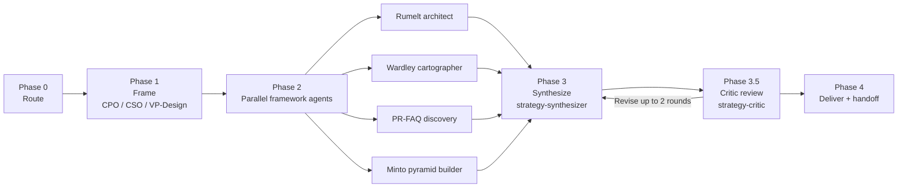

## Contents

| Reference                                   | When to load                                                                              |
| ------------------------------------------- | ----------------------------------------------------------------------------------------- |
| `references/orchestrator.md`                | Running the pipeline — five phases plus a critic pass                                     |
| `references/write-protocol.md`              | Canonical write-protocol block copied verbatim into every subagent prompt                 |
| `references/frameworks/INDEX.md`            | Routing guide — decision table + cross-framework composition                              |
| `references/frameworks/*.md`                | Per-framework files — Rumelt kernel, Wardley maps, Minto pyramid, Working Backwards       |
| `references/roles/cpo.md`                   | CPO role — product-line framer                                                            |
| `references/roles/cso.md`                   | CSO role — portfolio framer (build-vs-buy, M&A, 3–10 year horizon)                        |
| `references/roles/vp-design.md`             | VP Design role — customer-archetype and experience framer                                 |
| `references/roles/rumelt-architect.md`      | Runs the three-part kernel plus The Crux                                                  |
| `references/roles/wardley-cartographer.md`  | Builds the text-form Wardley map                                                          |
| `references/roles/pr-faq-discovery.md`      | Drafts a PR-FAQ as a discovery artifact (forcing function for customer-value clarity)     |
| `references/roles/minto-pyramid-builder.md` | Composes SCQA + MECE argument pyramid                                                     |
| `references/roles/strategy-synthesizer.md`  | Reads every packet, composes the final strategy memo                                      |
| `references/roles/strategy-critic.md`       | Reviews the memo on one axis (coherent + defensible), multi-dimensional rubric            |
| `templates/worklog-skeleton.md`             | Per-role work-log skeleton with embedded write-protocol                                   |
| `templates/strategy-memo.md`                | Final deliverable skeleton — Executive Summary, Diagnosis, Guiding Policy, Actions, Risks |
| `templates/rumelt-packet.md`                | Rumelt architect's output shape                                                           |
| `templates/wardley-packet.md`               | Wardley cartographer's output shape                                                       |
| `templates/pr-faq-discovery.md`             | PR-FAQ skeleton — press release + external FAQ + internal FAQ                             |
| `templates/minto-outline.md`                | SCQA + MECE outline                                                                       |

# Product strategy

One skill, one pipeline. Takes a strategic question → polished strategy memo through five phases that write their outputs to disk in real time. Framework agents in Phase 2 run in parallel. Synthesis and critic pass happen in sequence. The grouped framework file loads on demand — its decision table routes the orchestrator without every framework body being read.

## Pipeline at a glance

Every role runs as a general-purpose `Agent` with `model: "opus"` and a prompt built from the matching file in `references/roles/`. Phase 2 fans out in parallel with `run_in_background: true`. Full runbook with prompts, check-in cadence, and stuck detection lives in `references/orchestrator.md`.

## When to run which role

| User signal                                                              | Fan-out                           |
| ------------------------------------------------------------------------ | --------------------------------- |
| "Run a Rumelt kernel" / "what's the crux" / "our strategy feels fluffy"  | rumelt-architect only             |
| "Build a Wardley map" / "should we build or buy X" / "platform strategy" | wardley-cartographer only         |
| "Draft a PR-FAQ for a new product idea"                                  | pr-faq-discovery only             |
| "Structure this argument" / "build a Minto pyramid"                      | minto-pyramid-builder only        |
| "Write an executive strategy memo" / "full strategy read"                | all four frameworks, full memo    |
| "Portfolio bet" / "build vs buy across the portfolio"                    | CSO framing + wardley + rumelt    |
| "Customer-centric new product"                                           | CPO + VP-Design + pr-faq + rumelt |
| "Review my existing strategy memo"                                       | critic only                       |
| Targeted question on one sentence / section                              | Inline — no subagents             |

Run end-to-end with no approval gates between phases when the ask is clear. The pipeline is fully reversible — every file is on disk; nothing is published. Surface the plan inline, proceed. Use one `AskUserQuestion` only when audience, horizon, or deliverable shape is genuinely ambiguous.

## Write-protocol discipline

Every role follows the same rhythm: one unit of thought → edit the output file → next unit. Partial work on disk survives timeouts and context pressure; state held in working memory does not. The canonical block lives in `references/write-protocol.md` and is **copied verbatim** into every role prompt and every task skeleton — one source of truth, no paraphrasing.

Output files in `product-strategy/{{ slug }}/` are the source of truth: `framing.md`, `rumelt-packet.md`, `wardley-packet.md`, `pr-faq-packet.md`, `minto-outline.md`, `strategy-memo.md`, `review-strategy.md`. Nothing else is load-bearing.

## Framework family

Four frameworks ship as one routing guide plus four per-framework files. The INDEX's decision table routes the fan-out; per-framework files load only when a role needs them.

- **Rumelt Kernel + The Crux** — diagnosis, guiding policy, coherent actions; the Crux names the single pivotal challenge. Use for: roadmap prioritization, "our strategy is fluff," portfolio bets with unclear diagnosis.
- **Wardley Maps** — user need + value chain + evolution axis (Genesis → Custom → Product → Commodity) + climatic patterns + gameplay. Use for: build-vs-buy, platform strategy, open-source decisions.
- **Minto Pyramid** — SCQA + MECE-grouped supporting arguments. Thinking structure for the memo; also runs standalone when the ask is "structure this argument."
- **Working Backwards PR-FAQ** — press release + five customer questions + internal FAQ. Used here as a discovery artifact (forcing function for customer-value clarity), not a publication-ready document.

Full decision table and cross-framework composition guidance in `references/frameworks/INDEX.md`. Per-framework canonical structure, When-to-use / When-to-skip, templates, and citations live in one file per framework under `references/frameworks/` — `rumelt-kernel.md`, `wardley-maps.md`, `minto-pyramid.md`, `working-backwards.md`.

## Narrative framework composition

- **Strategy feeds discovery.** `strategy-memo.md` is the upstream input to `product-discovery`'s PRD derivation — HMW questions and job stories derive from the memo's customer framing and coherent actions.
- **Strategy feeds long-form documents.** `strategy-memo.md` + `pr-faq-packet.md` carry the Minto-shaped thinking; hand them off to whatever narrative-writing workflow your team uses.

The framework reference's "Cross-family composition" section names the common lineages — Working Backwards often follows a Rumelt kernel; Minto structures the output of either; Wardley feeds diagnosis when the challenge depends on "what's commoditizing."

## When NOT to use this skill

- **Writing a PRD, HMW questions, job stories, EARS specs, user stories.** Use `product-discovery`.
- **Writing a long-form narrative.** Strategy frameworks produce the thinking — hand the memo and PR-FAQ to whatever narrative-writing workflow your team uses.
- **Pure execution work.** If the diagnosis is already agreed and the team is building, strategy frameworks add overhead without insight.
- **Tactical decisions.** "Which color for the button" does not earn a kernel.

## Anti-patterns

- **Don't fan out all four frameworks by default.** The Phase 0 routing picks the subset that matches the ask — over-fanning wastes Opus compute and dilutes the synthesis.
- **Don't skip the framing phase.** Without `framing.md`, the Phase 2 roles don't know what question they are answering, and the synthesizer merges artifacts that don't share a thesis.
- **Don't let the synthesizer re-run a framework.** If a packet is thin, relaunch the framework role with the thin packet preloaded — don't paper over it in the memo.
- **Don't run more than 2 review-revise iterations.** After 2 rounds, surface remaining findings inline and hand the memo to the user rather than looping.
- **Don't reproduce framework bodies in the memo.** The memo uses the *output* of each packet (diagnosis, map-read, customer archetype, MECE groups), not the framework's canonical structure.
- **Don't drop a strategy memo on an execution problem.** If the real ask is "write a PRD," route to `product-discovery` instead of forcing a kernel.
